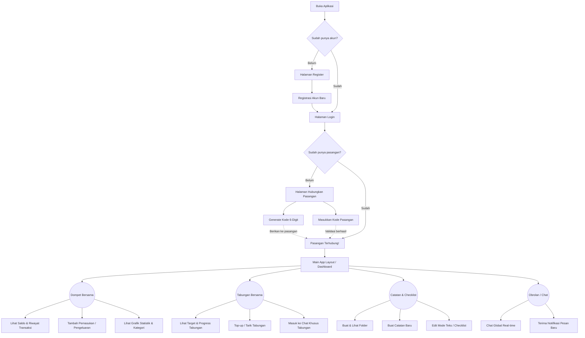

# Alur Penggunaan (User Flow) Aplikasi CoupleGrow

Berikut adalah gambaran singkat *User Flow* dari aplikasi CoupleGrow untuk pengguna dari awal membuka aplikasi hingga menggunakan fitur utamanya.

## Deskripsi Alur

1. **Autentikasi (Login/Register):** 
   Pengguna pertama kali wajib mendaftar atau masuk menggunakan Email dan Password.

2. **Proses Pairing (Mencari Pasangan):** 
   Jika pengguna belum memiliki pasangan (*partner_id* masih kosong), mereka akan langsung diarahkan ke halaman "Hubungkan Pasangan". Di sini, pengguna A bisa mem-generate kode 6-digit dan memberikannya kepada pengguna B. Pengguna B memasukkan kode tersebut untuk menautkan kedua akun.

3. **Eksplorasi Fitur Utama (Tab Navigation):**
   Setelah terhubung, pengguna masuk ke menu utama dengan navigasi bawah yang elegan:
   - 👛 **Dompet:** Pusat pencatatan keuangan harian. Pengguna bisa mencatat uang masuk dan keluar, serta melihat statistik (grafik batang) pengeluaran bulanan.
   - 🏦 **Tabungan:** Tempat membuat target menabung (misal: "Beli Rumah"). Setiap tabungan dilengkapi *progress bar* dan juga ruangan **Diskusi (Chat)** tersendiri khusus membahas tabungan tersebut.
   - 📝 **Notes:** Tempat menyimpan catatan penting atau to-do list berdua (belanjaan bulanan, itinerary liburan). Mendukung mode *Checklist* yang bisa dicentang.
   - 💬 **Chat:** Ruang obrolan utama (*Global Chat*) secara *real-time* berbasis WebSocket, lengkap dengan *toast notification* apabila ada pesan masuk baru.

Alur ini dirancang sangat simpel dan fokus pada keterbukaan finansial serta komunikasi yang mulus untuk pasangan.
